<div align="center">

# MyMD

**Typora 风格的 Windows Markdown 编辑器**

<sub>面向个人写作与效率提升 · 开源项目，欢迎交流与自用</sub>

<p align="center">
  <a href="https://github.com/caseclose"></a>
  <a href="mailto:fengw2002@gmail.com"></a>
  <a href="mailto:fengwang@stu.pku.edu.cn"></a>
</p>

所见即所得 · 专注写作 · 丰富导出

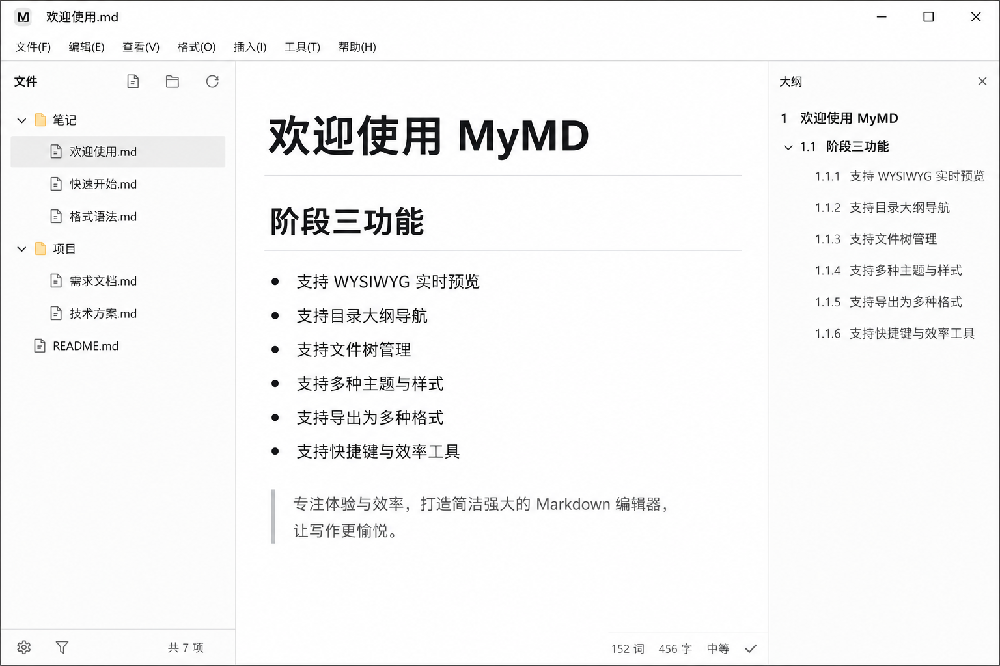

<sub>三栏布局：文件树 · 编辑区 · 大纲</sub>


</div>

---

## 为什么选择 MyMD？

| | |
|:---:|:---:|
| 🖊️ **沉浸式写作** | 专注 / 打字机模式，减少干扰 |
| 📂 **项目级管理** | 打开文件夹、侧边栏文件树、实时刷新 |
| 🧭 **结构化导航** | 右侧大纲，一键跳转标题 |
| 📤 **多格式导出** | PDF · HTML · PNG · Word · EPUB |
| 🎨 **可定制外观** | 亮/暗主题 + 导入自定义 CSS |

---

## 界面预览

### 写作体验

<table>
<tr>
<td width="50%" valign="top">

**亮色主界面**

日常写作默认视图，简洁克制。


</td>
<td width="50%" valign="top">

**暗色主题**

`Ctrl+Shift+T` 一键切换，夜间更护眼。

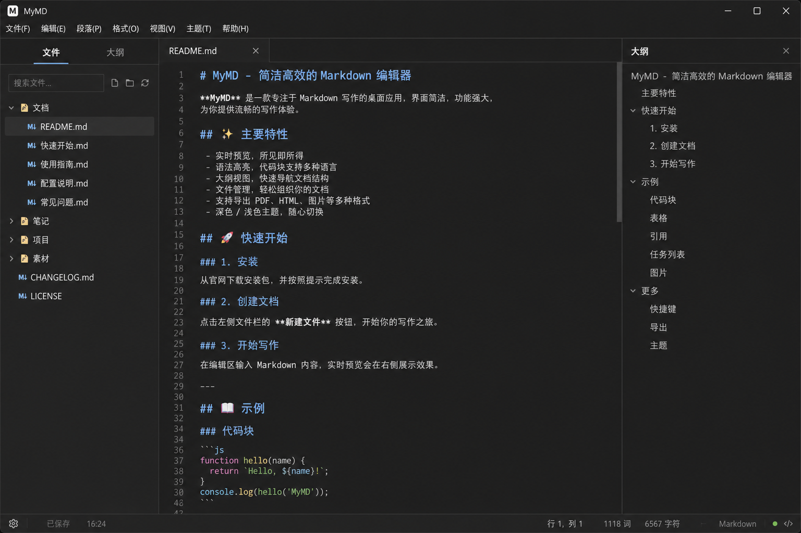

</td>
</tr>
<tr>
<td width="50%" valign="top">

**专注模式**

`F8` 淡化非当前段落，聚焦思路。

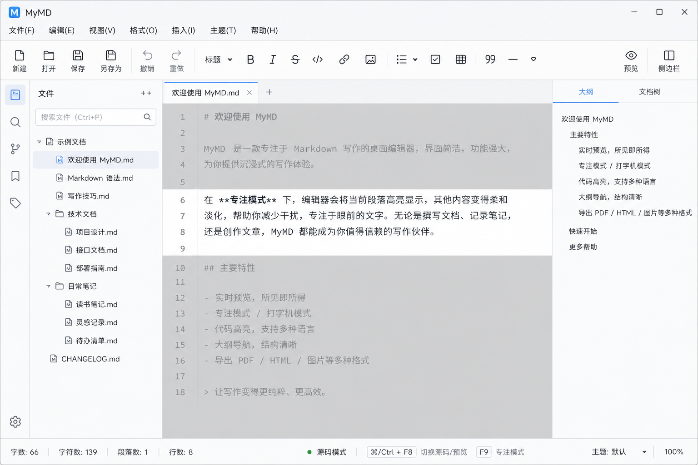

</td>
<td width="50%" valign="top">

**打字机模式**

`F9` 让光标始终停留在舒适视线位置。


</td>
</tr>
<tr>
<td width="50%" valign="top">

**源码模式**

`Ctrl+/` 在 WYSIWYG 与 Markdown 源码间切换。

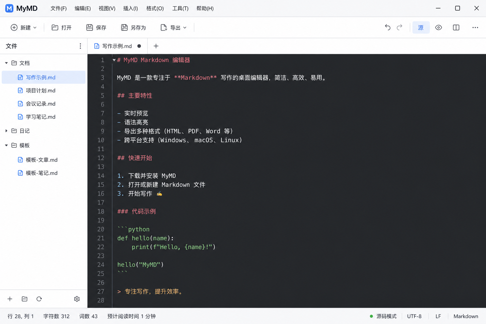

</td>
<td width="50%" valign="top">

**状态栏**

字数统计、路径、自动保存与模式指示。

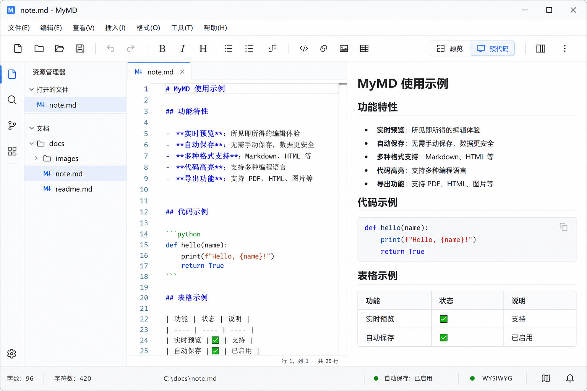

</td>
</tr>
</table>

### 导航与组织

<table>
<tr>
<td width="50%" valign="top">

**文件树侧边栏**

`Ctrl+Shift+O` 打开文件夹，快速切换文档。

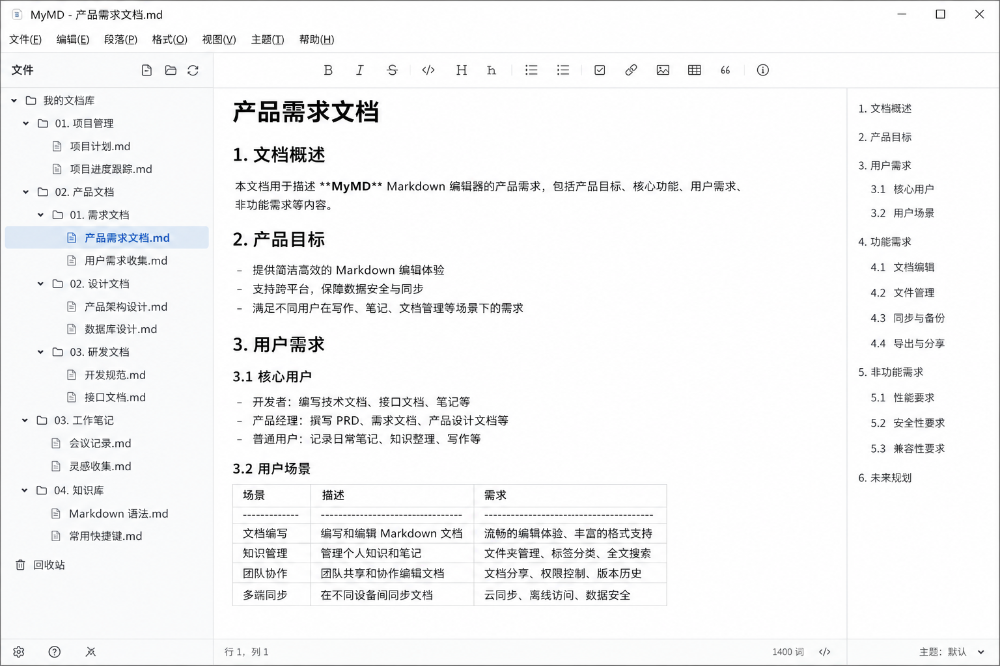

</td>
<td width="50%" valign="top">

**大纲面板**

`Ctrl+Shift+L` 切换，长文结构一目了然。

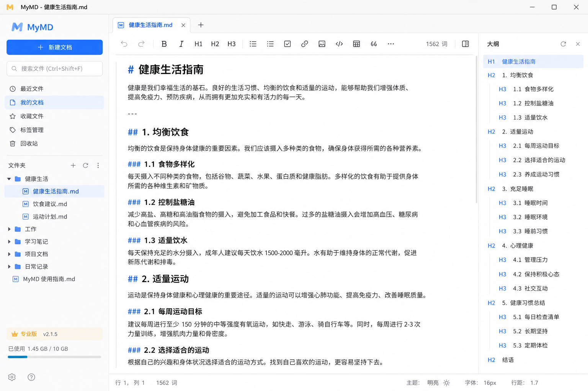

</td>
</tr>
<tr>
<td colspan="2" valign="top">

**查找与替换**

`Ctrl+F` / `Ctrl+H`，支持区分大小写与批量替换。

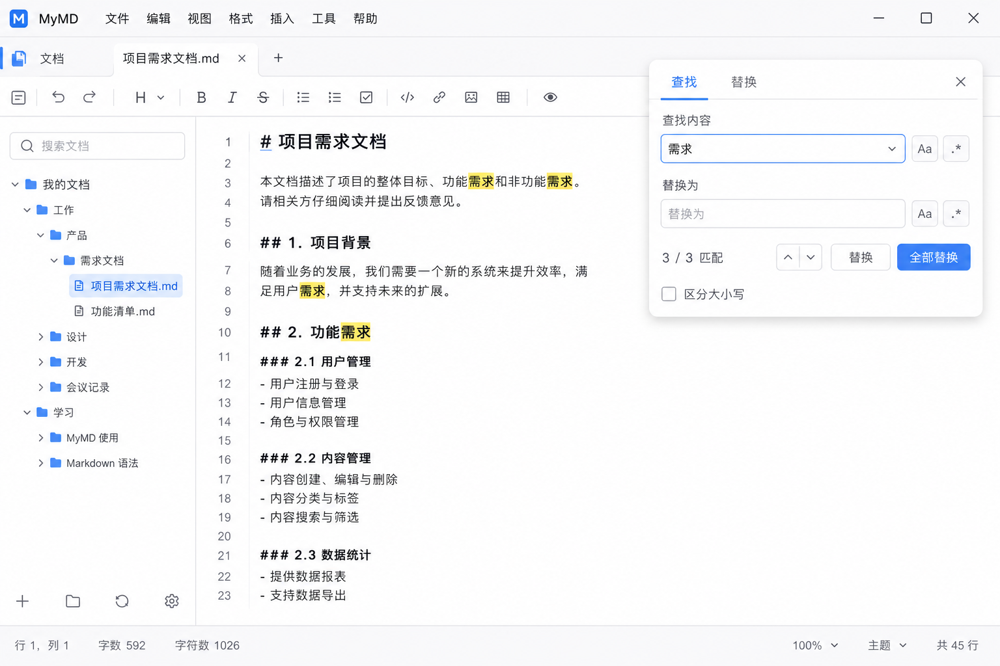

</td>
</tr>
</table>

### 富文本能力

<table>
<tr>
<td width="33%" valign="top">

**数学公式**

KaTeX 渲染行内与块级公式。

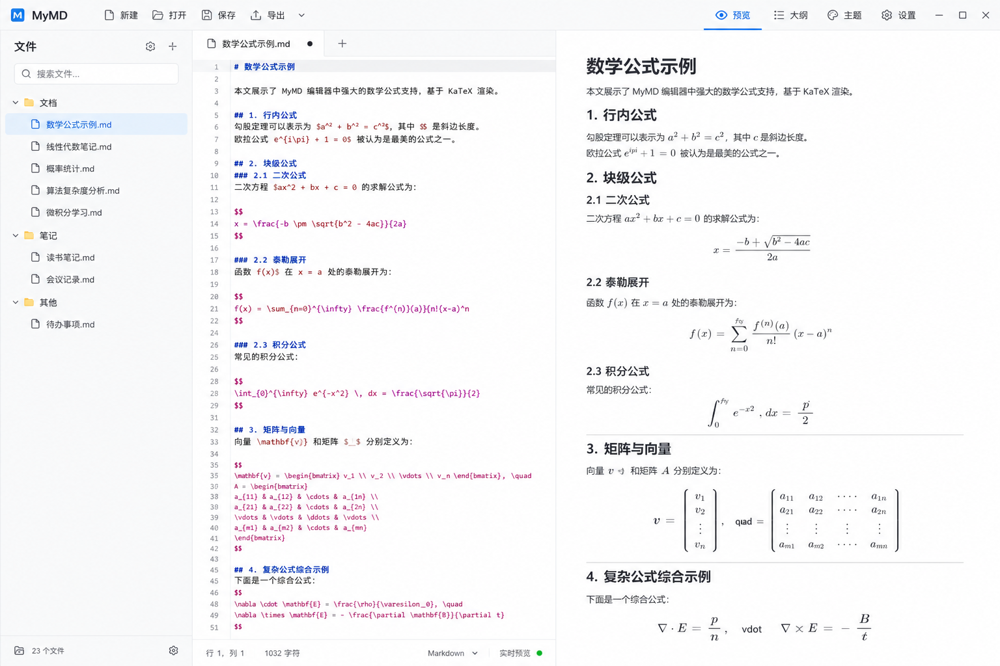

</td>
<td width="33%" valign="top">

**Mermaid 图表**

流程图、时序图等直接写在文档里。

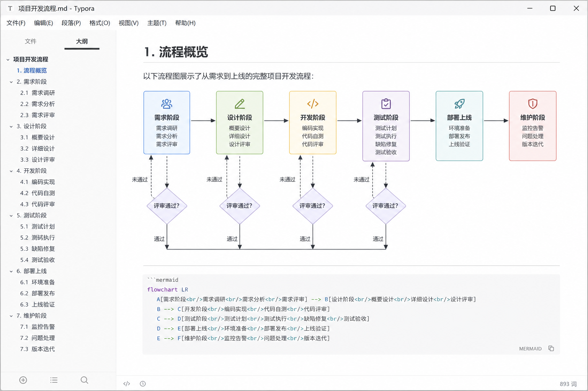

</td>
<td width="33%" valign="top">

**代码高亮**

CodeMirror 驱动，多语言语法着色。

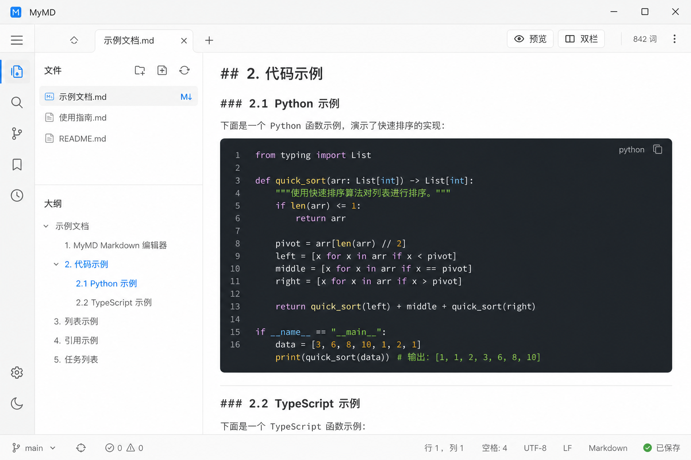

</td>
</tr>
<tr>
<td width="50%" valign="top">

**图片嵌入**

上传至文档旁 `assets/` 目录，本地引用。

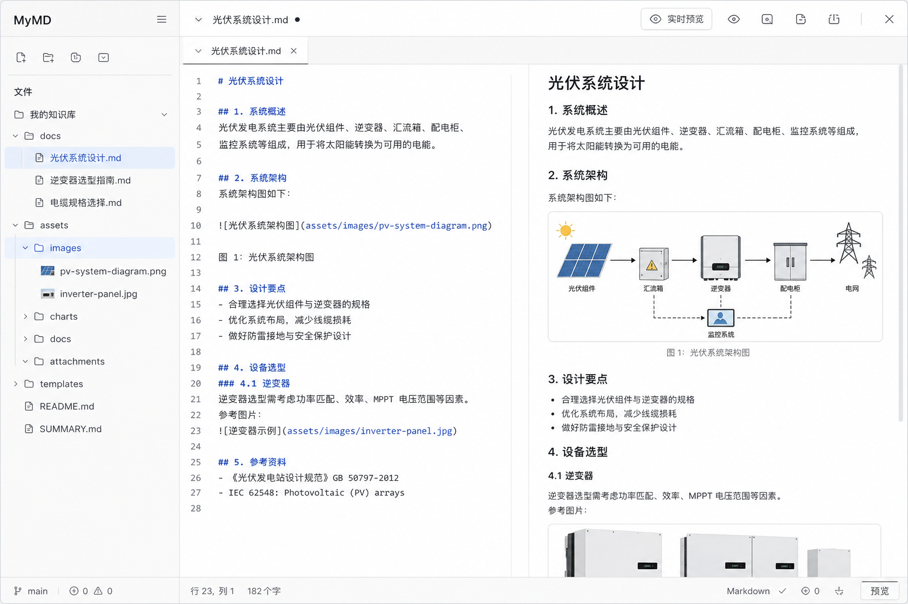

</td>
<td width="50%" valign="top">

**自定义主题**

导入 `.css` 主题文件，打造个人风格。

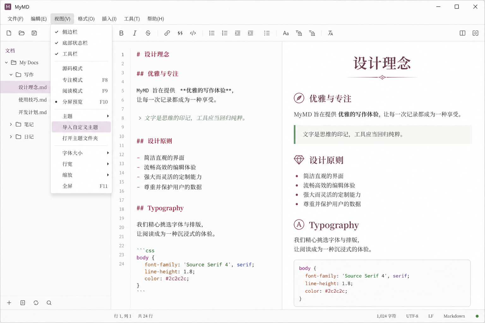

</td>
</tr>
</table>

### 导出

<table>
<tr>
<td width="50%" valign="top">

**导出菜单**

PDF / HTML / 无样式 HTML / PNG / Word / EPUB。

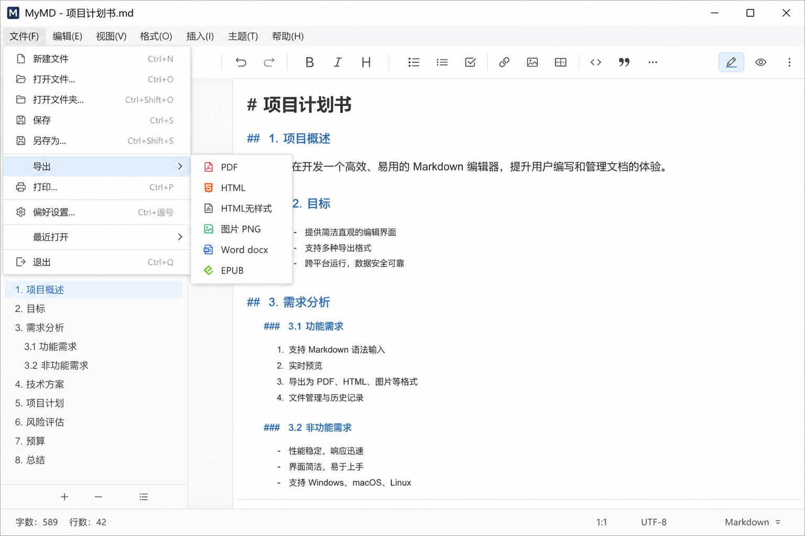

</td>
<td width="50%" valign="top">

**PDF 导出**

基于打印引擎，适合分享与归档。

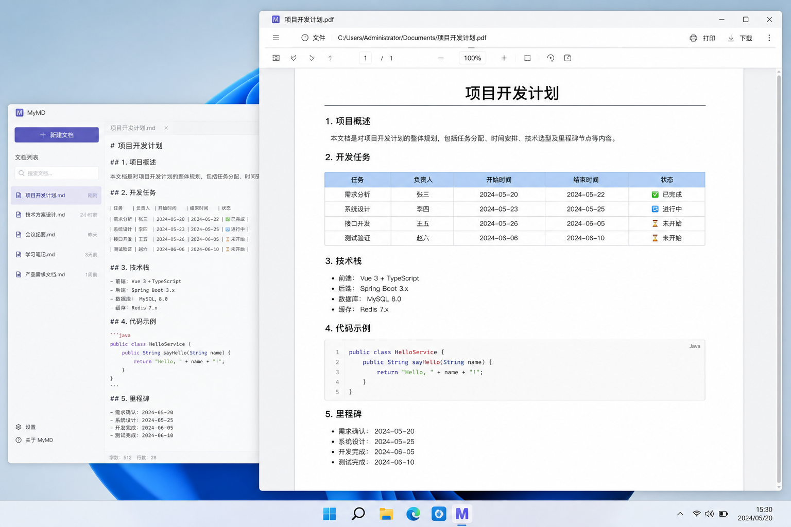

</td>
</tr>
</table>

> Word / EPUB 导出需要安装 [Pandoc](https://pandoc.org/installing.html)。

---

## 功能清单

| 类别 | 功能 |
|------|------|
| 编辑 | GFM 所见即所得、源码模式、撤销/重做 |
| 写作 | 专注模式 `F8`、打字机模式 `F9`、自动保存（30s） |
| 导航 | 文件树、大纲、查找/替换 |
| 富内容 | KaTeX、Mermaid、代码高亮、图片上传 |
| 外观 | 亮/暗主题、自定义 CSS 主题 |
| 导出 | PDF、HTML、PNG、Word（Pandoc）、EPUB（Pandoc） |
| 系统 | 无边框窗口、`.md` 文件关联、单实例打开 |

---

## 快速开始

### 开发

```powershell
git clone https://github.com/caseclose/mymd-editor.git
cd mymd-editor
npm install
npm run dev
```

### 构建安装包

```powershell
npm run build        # 编译
npm run build:win    # 打包 Windows 安装程序 → release/
```

### 测试

```powershell
npm test
```

---

## 快捷键

| 操作 | 快捷键 |
|------|--------|
| 新建 | `Ctrl+N` |
| 打开 | `Ctrl+O` |
| 打开文件夹 | `Ctrl+Shift+O` |
| 保存 | `Ctrl+S` |
| 另存为 | `Ctrl+Shift+S` |
| 导出 PDF | `Ctrl+Shift+E` |
| 切换主题 | `Ctrl+Shift+T` |
| 切换侧边栏 | `Ctrl+\` |
| 切换大纲 | `Ctrl+Shift+L` |
| 专注模式 | `F8` |
| 打字机模式 | `F9` |
| 源码模式 | `Ctrl+/` |
| 查找 | `Ctrl+F` |
| 替换 | `Ctrl+H` |

---

## 技术栈

```
Electron 37  +  electron-vite  +  React 19  +  TypeScript
        ↓
@milkdown/crepe (WYSIWYG)  +  Tailwind CSS  +  electron-builder
```

| 模块 | 用途 |
|------|------|
| [@milkdown/crepe](https://milkdown.dev/) | WYSIWYG Markdown 内核 |
| KaTeX | 数学公式 |
| Mermaid | 图表 |
| chokidar | 文件夹监听 |
| Pandoc（可选） | Word / EPUB 导出 |

---

## 许可证

MIT
